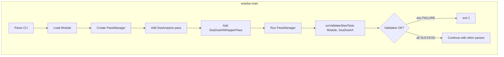

# Патч Sea-DSA: встраивание проверки aliascheck.h по образцу SVF

## Цель

**Встроить проверку как в SVF:** не вводить новый тип анализа, а после построения DSA-модели (через `DsaAnalysis` pass) выполнять один проход: обойти модуль, найти вызовы MAYALIAS/NOALIAS/MUSTALIAS из [aliascheck.h](tests/Test-Suite/aliascheck.h), для каждой пары аргументов запросить у **уже построенной** alias-модели результат через `SeaDsaAAResult::alias()`, сравнить с ожиданием и вывести **SUCCESS** или **FAILURE**; при любой FAILURE — `exit(1)`.

- Какой анализ проверяется: Sea-DSA использует один тип анализа (DSA), который строится через `DsaAnalysis` pass. После выполнения pass manager'а имеется построенная DSA-модель, доступная через `SeaDsaAAWrapperPass`; проверка итерирует модуль и дергает `SeaDsaAAResult::alias(MemoryLocation, MemoryLocation, AAQueryInfo)`.
- Отдельного режима «только валидация» или нового типа анализа не добавляем: проверка всегда выполняется после выполнения pass manager'а с DsaAnalysis, по аналогии с `validateTests()` в SVF.

**Хранение патчей:** все изменения Sea-DSA хранятся в `patches/seadsa/` и накладываются скриптом `scripts/apply_seadsa_patches.sh` после checkout, чтобы на другой машине процесс воспроизводился без потерь.

---

## Хранение и наложение патчей Sea-DSA

### Принцип

- В репозитории **alias-analysis-research** патчи для Sea-DSA не вносятся напрямую в каталог `sea-dsa/`. Они лежат в **отдельной директории** (например `patches/seadsa/`) в корне проекта.
- Наложение выполняется **специальным скриптом** (например `scripts/apply_seadsa_patches.sh`). Скрипт вызывается после `01_checkout_sources.sh` и до `02_build_seadsa.sh` (или внутри шага сборки Sea-DSA).
- На новой машине: клонирование репозитория → `checkout` (чистый Sea-DSA) → запуск скрипта наложения патчей → сборка Sea-DSA. Изменения воспроизводятся без ручного редактирования дерева sea-dsa.

### Структура

- **Директория с патчами:** `patches/seadsa/` в корне проекта.
  - Файлы: `001-validate-alias-tests.patch`, `002-… .patch` и т.д. (порядок в имени задаёт порядок применения, если скрипт применяет по сортировке).
  - Каждый патч создаётся из изменённого дерева sea-dsa командой `git diff` / `git format-patch` относительно коммита, на который указывает checkout.
- **Скрипт наложения:** `scripts/apply_seadsa_patches.sh`.
  - Входные данные: `ROOT` (корень репо), каталог Sea-DSA `$ROOT/sea-dsa`, каталог патчей `$ROOT/patches/seadsa`.
  - Действия: перейти в `sea-dsa`, для каждого `.patch` из `patches/seadsa/` (в заданном порядке) выполнить `git apply -p0` (или `patch -p1`). При ошибке — вывести сообщение и выйти с ненулевым кодом.
  - Идемпотентность: если патч уже применён, `git apply` может отказываться; скрипт может проверять статус (`git apply --check`) и пропускать уже наложенные, либо применять с `--reverse` для проверки. Простой вариант: применять по порядку и при первой ошибке останавливаться.

### Интеграция в цепочку сборки

- **Вариант A:** Отдельный шаг в Makefile, например `apply-seadsa-patches`, зависящий от `checkout`; цель `tools-seadsa` зависит от `apply-seadsa-patches`. Пользователь вызывает `make checkout`, затем `make apply-seadsa-patches` (или один раз `make tools-seadsa`, который тянет за собой checkout и apply).
- **Вариант B:** В [scripts/02_build_seadsa.sh](scripts/02_build_seadsa.sh) в начале вызвать `scripts/apply_seadsa_patches.sh` (если каталог `patches/seadsa` существует и не пуст). Тогда `make tools-seadsa` после checkout автоматически наложит патчи и соберёт Sea-DSA.

Рекомендация: **Вариант B** — в начале `02_build_seadsa.sh` вызывать скрипт наложения патчей; так на любой машине достаточно `make checkout` и `make tools-seadsa`, без отдельной цели для apply.

### Создание патча после внесения изменений

1. Внести изменения в локальное дерево `sea-dsa/` (как описано в разделах ниже).
2. Из корня репозитория: `cd sea-dsa && git add ... && git diff --cached --no-prefix > ../patches/seadsa/001-validate-alias-tests.patch`. Убедиться, что пути в патче относительные от корня sea-dsa.
3. Закоммитить только файлы в `patches/seadsa/` и `scripts/apply_seadsa_patches.sh`; каталог `sea-dsa/` остаётся неподтверждённым (или в .gitignore, если он не коммитится). На другой машине после clone + checkout будет чистый sea-dsa, затем apply при сборке наложит патч.

### Чеклист по патчам и скрипту

- Создать директорию `patches/seadsa/` в корне репозитория.
- Реализовать `scripts/apply_seadsa_patches.sh`: обход `patches/seadsa/*.patch`, применение из каталога `sea-dsa/` (`git apply -p0 --whitespace=fix`), обработка ошибок.
- В начале `02_build_seadsa.sh` вызывать `apply_seadsa_patches.sh` (если есть `patches/seadsa` и в нём есть .patch-файлы).
- После реализации функциональности валидации сгенерировать патч и положить в `patches/seadsa/` (например `001-validate-alias-tests.patch`).

---

## Архитектура



- **Как в SVF:** после выполнения pass manager'а с `DsaAnalysis` и `SeaDsaAAWrapperPass` один раз выполняется проход по модулю: поиск вызовов MAYALIAS/NOALIAS/MUSTALIAS, запрос к построенной модели через `SeaDsaAAResult::alias(MemoryLocation, MemoryLocation, AAQueryInfo)`, сравнение с ожиданием, вывод SUCCESS/FAILURE.
- **Место вызова:** в [tools/seadsa.cc](sea-dsa/tools/seadsa.cc) в `main()` сразу после `pass_manager.run(*module.get())`: получить `SeaDsaAAWrapperPass` из pass manager (если он был добавлен), вызвать `runValidateAliasTests(module, seaDsaAA)`; при возврате `false` — `exit(1)`. Дальше как сейчас: остальные опции (dot, viewer и т.д.) выполняются только если валидация прошла успешно.

---

## Ключевые файлы и изменения

### 1. Функция валидации (проход по построенной alias-модели)

- **Файл:** новый [sea-dsa/tools/ValidateAliasTests.cc](sea-dsa/tools/ValidateAliasTests.cc) (и при необходимости .hh), либо логика в [seadsa.cc](sea-dsa/tools/seadsa.cc).
- **Сигнатура:** `bool runValidateAliasTests(llvm::Module &M, seadsa::SeaDsaAAResult &AA)` — возвращает `false`, если была хотя бы одна FAILURE.
- **Логика:** обход модуля `M`, поиск вызовов MAYALIAS/NOALIAS/MUSTALIAS/PARTIALALIAS (и манглированных имён), для каждого вызова создать `MemoryLocation` из аргументов, запрос к **уже построенной** alias-модели: `AA.alias(MemLoc1, MemLoc2, AAQueryInfo)`, сравнение с ожиданием, вывод SUCCESS/FAILURE. Код самого DSA-анализа не меняется — используется только его результат в `SeaDsaAAResult`.

### 2. Встраивание в пайплайн (main, как в SVF)

- **Файл:** [sea-dsa/tools/seadsa.cc](sea-dsa/tools/seadsa.cc)
- После `pass_manager.run(*module.get())`: получить `SeaDsaAAWrapperPass` из pass manager (если он был добавлен), вызвать `runValidateAliasTests(*module.get(), seaDsaAA.getResult())`; при возврате `false` — `exit(1)`. Условие: проверка выполняется только если `SeaDsaAAWrapperPass` был добавлен в pass manager (что происходит всегда, так как он добавляется в строке 183).

### 3. Логика валидации (алгоритм runValidateAliasTests)

**Алгоритм:**

1. Взять модуль `M` (переданный параметр).
2. Имена проверяемых функций (как в SVF):
  - Успех: `MAYALIAS`, `NOALIAS`, `MUSTALIAS`, `PARTIALALIAS`
  - Манглированные (C++): `_Z8MAYALIASPvS_`, `_Z7NOALIASPvS_`, `_Z9MUSTALIASPvS_`, `_Z12PARTIALALIASPvS_`
  - Опционально (фаза 2): `EXPECTEDFAIL_MAYALIAS`, `EXPECTEDFAIL_NOALIAS` и их манглированные имена — ожидаемая «неудача» (результат анализа должен не совпадать с именем аннотации).
3. Обход по всем функциям модуля → по всем базовым блокам → по всем инструкциям. Для каждой `CallInst`:
  - Получить вызываемую функцию (`getCalledFunction()` или через значение при косвенном вызове; для Test-Suite вызовы обычно прямые).
  - Если имя не из списка выше — пропустить.
  - Взять аргументы: `getArgOperand(0)`, `getArgOperand(1)` (два указателя).
  - Создать `MemoryLocation` для каждого аргумента: `MemoryLocation::get(Value, DL)` или `MemoryLocation::getBeforeOrAfter(Value)`.
  - Вызов: `llvm::AliasResult result = AA.alias(MemLoc1, MemLoc2, AAQueryInfo())` (третий аргумент — `AAQueryInfo` для контекстной информации).
4. Правила проверки (совпадают с SVF):
  - **MAYALIAS:** успех, если `result == MayAlias || result == MustAlias`
  - **NOALIAS:** успех, если `result == NoAlias`
  - **MUSTALIAS:** успех, если `result == MayAlias || result == MustAlias`
  - **PARTIALALIAS:** успех, если `result == MayAlias` (при желании можно учесть PartialAlias, если Sea-DSA его возвращает)
5. Вывод в stdout/stderr (единообразно с SVF):
  - При успехе: строка вида `\t SUCCESS :MAYALIAS check at (SourceLoc)\n`
  - При неудаче: строка вида `\t FAILURE :NOALIAS check at (SourceLoc)\n`
  - SourceLoc можно получить через `llvm::Instruction::getDebugLoc()` и форматировать (файл:строка:столбец) или использовать `DILocation::get()` для получения `DILocation` и форматирования.
6. По завершении обхода: вернуть `true`, если все проверки SUCCESS; `false` при хотя бы одной FAILURE. Вызывающий код (main) при `false` выполняет `exit(1)`.

### 4. Зависимости и API

- **SeaDsaAAResult:** метод `alias(const MemoryLocation &, const MemoryLocation &, AAQueryInfo &)` → `llvm::AliasResult` ([sea-dsa/include/seadsa/SeaDsaAliasAnalysis.hh](sea-dsa/include/seadsa/SeaDsaAliasAnalysis.hh) — строка 43-44).
- **AliasResult:** в LLVM есть `NoAlias`, `MayAlias`, `PartialAlias`, `MustAlias` (enum `llvm::AliasResult` из `llvm/Analysis/AliasAnalysis.h`).
- **MemoryLocation:** создать через `MemoryLocation::get(Value, DataLayout)` или `MemoryLocation::getBeforeOrAfter(Value)` из `llvm/Analysis/MemoryLocation.h`.
- **AAQueryInfo:** создать пустой `llvm::AAQueryInfo()` из `llvm/Analysis/AliasAnalysis.h`.
- Итерация модуля: стандартный обход `Module::functions()` → `Function::basic_blocks()` → `BasicBlock::instructions()`; для каждой инструкции проверка `isa<CallInst>` и работа с `CallInst`.

### 5. Использование из командной строки

Проверка выполняется при **любом** запуске seadsa после выполнения pass manager'а:

```bash
seadsa module.bc
seadsa module.bc -sea-dsa-dot
seadsa module.bc -sea-dsa-stats
```

Отдельного режима «только валидация» нет — как в SVF, валидация встроена в пайплайн после выполнения DSA-анализа.

### 6. Интеграция в скрипты репозитория (вне патча Sea-DSA)

- В [scripts/04_run_svf_tsuite.sh](scripts/04_run_svf_tsuite.sh) (или в отдельном скрипте для Sea-DSA) можно добавить ветку для категорий, которые решено гонять через Sea-DSA: вызывать `seadsa "$f"` и перенаправлять вывод в каталог результатов (например `results/Test-Suite/SeaDSA/...`). Это можно оформить отдельным маленьким шагом после принятия патча.

---

## Ограничения и опциональные расширения

- **EXPECTEDFAIL_***: в первом варианте патча можно не реализовывать; при необходимости — отдельный проход по тем же вызовам с инвертированной проверкой и меткой «expected failure».
- **Косвенные вызовы:** если в Test-Suite все вызовы MAYALIAS/NOALIAS — прямые, достаточно проверять `getCalledFunction()`; иначе нужно разрешать указатель на функцию и проверять имена целевых функций.
- **MemoryLocation:** для простых указателей можно использовать `MemoryLocation::getBeforeOrAfter(Value)` или `MemoryLocation::get(Value, Module.getDataLayout())` для более точного размера (если известен тип).

---

## Сводка: встраивание проверки по образцу SVF

- **Когда срабатывает:** при любом запуске seadsa после выполнения pass manager'а с `DsaAnalysis` и `SeaDsaAAWrapperPass`.
- **Где вызывается:** в [seadsa.cc](sea-dsa/tools/seadsa.cc) в `main()`, сразу после `pass_manager.run(*module.get())`.
- **Что используется:** уже построенный `SeaDsaAAResult` из `SeaDsaAAWrapperPass` — один проход по модулю, запрос `alias(MemLoc1, MemLoc2, AAQI)` для каждой пары из MAYALIAS/NOALIAS/MUSTALIAS; код самого DSA-анализа не меняется.
- **При FAILURE:** `exit(1)`, дальнейшие опции (dot, viewer и т.д.) не выполняются.
- **Отдельного режима «только валидация» или нового типа анализа нет** — проверка встроена в пайплайн, как `validateTests()` в SVF.


---

## Чеклист реализации

**Патчи и скрипт наложения (чтобы изменения не терялись при checkout на другой машине):**

1. Создать директорию `patches/seadsa/` в корне репозитория.
2. Реализовать [scripts/apply_seadsa_patches.sh](scripts/apply_seadsa_patches.sh): применение всех `patches/seadsa/*.patch` к дереву `sea-dsa/` (например `git apply -p0` из каталога sea-dsa), обработка ошибок, ненулевой код выхода при сбое.
3. В начале [scripts/02_build_seadsa.sh](scripts/02_build_seadsa.sh) вызывать `apply_seadsa_patches.sh` (если есть каталог `patches/seadsa` и в нём есть .patch-файлы).

**Функциональность валидации (в дереве sea-dsa, затем экспорт в патч):**

1. Реализовать `runValidateAliasTests(llvm::Module &M, seadsa::SeaDsaAAResult &AA)` (поиск вызовов MAYALIAS/NOALIAS/MUSTALIAS/PARTIALALIAS, создание `MemoryLocation` из аргументов, запрос к построенной модели `AA.alias(MemLoc1, MemLoc2, AAQI)`, печать SUCCESS/FAILURE, возврат bool) — в новом файле под tools или в seadsa.cc.
2. В [seadsa.cc](sea-dsa/tools/seadsa.cc): после `pass_manager.run(*module.get())` получить `SeaDsaAAWrapperPass` из pass manager и вызвать `runValidateAliasTests(*module.get(), seaDsaAA.getResult())`; при возврате `false` — `exit(1)`.
3. Хелпер для source location (`getDebugLoc()` / `DILocation`) при выводе.
4. Сгенерировать патч из изменённого дерева sea-dsa и положить в `patches/seadsa/` (например `001-validate-alias-tests.patch`).
5. Сборка и прогон на .bc из Test-Suite (после apply патча).
6. (Опционально) Интеграция вызова seadsa в скрипты репозитория и обновление README.
