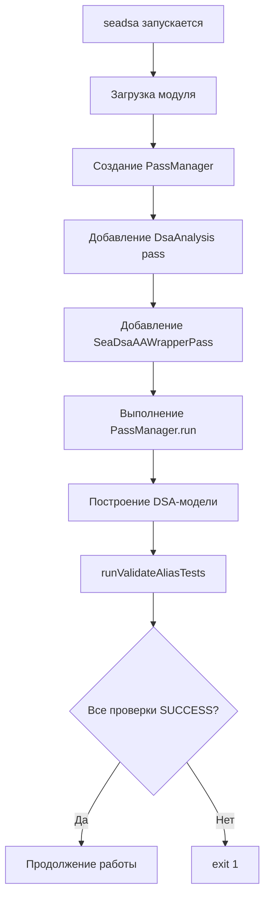

# Sea-DSA Test-Suite Validation Patch

## Обзор

В Sea-DSA добавлена поддержка автоматической валидации alias-тестов из SVF Test-Suite. После выполнения DSA-анализа инструмент автоматически проверяет все вызовы функций `MAYALIAS`, `NOALIAS`, `MUSTALIAS` и `PARTIALALIAS` из файла `aliascheck.h`, сравнивает результаты с ожидаемыми и выводит `SUCCESS` или `FAILURE` для каждой проверки. При любой неудачной проверке инструмент завершается с кодом возврата 1.

## Что добавлено

### 1. Функциональность валидации

**Новые файлы:**
- `sea-dsa/tools/ValidateAliasTests.hh` — заголовочный файл с объявлением функции валидации
- `sea-dsa/tools/ValidateAliasTests.cc` — реализация функции валидации

**Изменённые файлы:**
- `sea-dsa/tools/seadsa.cc` — добавлен вызов валидации после выполнения pass manager'а
- `sea-dsa/tools/CMakeLists.txt` — добавлен `ValidateAliasTests.cc` в список исходных файлов

### 2. Система патчей

**Новые файлы:**
- `patches/seadsa/001-validate-alias-tests.patch` — патч со всеми изменениями Sea-DSA
- `scripts/apply_seadsa_patches.sh` — скрипт для автоматического наложения патчей

**Изменённые файлы:**
- `scripts/02_build_seadsa.sh` — добавлен вызов скрипта наложения патчей перед сборкой

## Как это работает

### Архитектура



### Алгоритм валидации

1. **Поиск вызовов проверочных функций:**
   - Обход всех функций модуля → базовых блоков → инструкций
   - Поиск вызовов функций: `MAYALIAS`, `NOALIAS`, `MUSTALIAS`, `PARTIALALIAS`
   - Поддержка манглированных имён C++: `_Z8MAYALIASPvS_`, `_Z7NOALIASPvS_`, `_Z9MUSTALIASPvS_`, `_Z12PARTIALALIASPvS_`

2. **Проверка alias:**
   - Для каждого найденного вызова берутся два аргумента (указатели)
   - Создаются `MemoryLocation` для каждого аргумента через `MemoryLocation::getBeforeOrAfter()`
   - Выполняется запрос к построенной DSA-модели: `SeaDsaAAResult::alias(MemLoc1, MemLoc2, AAQueryInfo)`

3. **Сравнение результатов:**
   - **MAYALIAS:** успех, если результат `MayAlias` или `MustAlias`
   - **NOALIAS:** успех, если результат `NoAlias`
   - **MUSTALIAS:** успех, если результат `MayAlias` или `MustAlias`
   - **PARTIALALIAS:** успех, если результат `MayAlias` или `PartialAlias`

4. **Вывод результатов:**
   - При успехе: `\t SUCCESS :MAYALIAS check at (file:line:col)\n`
   - При неудаче: `\t FAILURE :NOALIAS check at (file:line:col)\n`
   - Source location извлекается из debug information через `DILocation`

5. **Завершение:**
   - Если все проверки успешны — возврат `true`, продолжение работы
   - Если хотя бы одна проверка неудачна — возврат `false`, `exit(1)`

## Использование

### Автоматическое применение патчей

Патчи применяются автоматически при сборке Sea-DSA через скрипт `scripts/02_build_seadsa.sh`:

```bash
make tools-seadsa
# или напрямую:
bash scripts/02_build_seadsa.sh
```

Скрипт проверяет наличие директории `patches/seadsa/` и файлов `*.patch` в ней, затем автоматически применяет их к дереву `sea-dsa/` перед сборкой.

### Запуск валидации

Валидация выполняется автоматически при каждом запуске `seadsa`:

```bash
seadsa module.bc
seadsa module.bc -sea-dsa-dot
seadsa module.bc -sea-dsa-stats
```

Валидация выполняется после построения DSA-модели, до выполнения остальных опций (dot, viewer, stats и т.д.). Если валидация обнаруживает ошибки, инструмент завершается с кодом 1, и дальнейшие опции не выполняются.

### Пример вывода

```
	 SUCCESS :MAYALIAS check at (/path/to/test.c:25:5)
	 SUCCESS :MAYALIAS check at (/path/to/test.c:27:5)
	 FAILURE :NOALIAS check at (/path/to/test.c:26:5)
	 FAILURE :NOALIAS check at (/path/to/test.c:28:5)
```

При наличии `FAILURE` инструмент завершится с кодом 1.

## Структура файлов

### Патчи

```
patches/seadsa/
└── 001-validate-alias-tests.patch    # Патч со всеми изменениями
```

### Скрипты

```
scripts/
├── apply_seadsa_patches.sh           # Скрипт наложения патчей
└── 02_build_seadsa.sh                # Скрипт сборки (обновлён)
```

### Исходный код Sea-DSA

```
sea-dsa/tools/
├── ValidateAliasTests.hh             # Заголовочный файл валидации
├── ValidateAliasTests.cc             # Реализация валидации
├── seadsa.cc                         # Главный файл (обновлён)
└── CMakeLists.txt                    # CMake конфигурация (обновлён)
```

## Технические детали

### API используемые в реализации

- **SeaDsaAAResult::alias()** — метод для проверки alias между двумя memory locations
- **MemoryLocation::getBeforeOrAfter()** — создание memory location из LLVM Value
- **AAQueryInfo** — контекстная информация для alias queries (создаётся как `AAQueryInfo(nullptr)`)
- **DILocation** — debug information для получения source location

### Зависимости

Валидация использует следующие компоненты LLVM:
- `llvm::Module` — для обхода модуля
- `llvm::CallBase` — для работы с вызовами функций
- `llvm::MemoryLocation` — для представления memory locations
- `llvm::AliasResult` — для результатов alias-анализа
- `llvm::DILocation` — для source location information
- `llvm::Optional` — вместо `std::optional` (C++14 совместимость)
- `llvm::None` — вместо `std::nullopt` (C++14 совместимость)

### Совместимость с C++14

Sea-DSA компилируется с C++14, поэтому используются типы LLVM вместо стандартных C++17:
- `llvm::Optional<T>` вместо `std::optional<T>`
- `llvm::None` вместо `std::nullopt`
- Проверка наличия значения через `hasValue()` и получение через `getValue()`
- `AAQueryInfo` создаётся с параметром `nullptr`: `AAQueryInfo(nullptr)`
- Каст для `createSeaDsaAAWrapperPass()`: `static_cast<seadsa::SeaDsaAAWrapperPass *>()`

### Обработка ошибок

- Если `SeaDsaAAWrapperPass` не был создан (nullptr), валидация пропускается
- Если модуль пуст или не содержит проверочных вызовов, валидация возвращает `true`
- При ошибках компиляции или выполнения патч не применяется, сборка продолжается без валидации
- Использование LLVM типов (`llvm::Optional`, `llvm::None`) обеспечивает совместимость с C++14

## Интеграция с Test-Suite

Для запуска валидации на тестах из Test-Suite можно использовать следующий скрипт:

```bash
#!/bin/bash
source scripts/env.sh

for bc_file in tests/Test-Suite/build/bc/basic_c_tests/*.bc; do
    echo "Processing $(basename $bc_file)..."
    "$SDSA_CLI" "$bc_file" &> "results/$(basename $bc_file).log"
    if [ $? -eq 0 ]; then
        echo "  SUCCESS"
    else
        echo "  FAILURE"
    fi
done
```

Результаты валидации будут записаны в лог-файлы, где можно увидеть строки `SUCCESS` и `FAILURE` для каждой проверки.

## Отличия от PhASAR реализации

1. **API:** Sea-DSA использует стандартный LLVM `AliasResult` и `MemoryLocation`, в то время как PhASAR использует собственные типы
2. **Архитектура:** Sea-DSA работает через LLVM Pass Manager, PhASAR использует собственный фреймворк анализа
3. **Точка входа:** В Sea-DSA валидация вызывается после `pass_manager.run()`, в PhASAR — после построения `HelperAnalyses`
4. **Совместимость:** Sea-DSA компилируется с C++14, поэтому используются `llvm::Optional` и `llvm::None` вместо стандартных C++17 типов

## Важные детали реализации

### Совместимость с C++14

Поскольку Sea-DSA компилируется с C++14 (а не C++17), в реализации используются типы LLVM вместо стандартных:

- **`llvm::Optional<T>`** вместо `std::optional<T>` — для опциональных значений
- **`llvm::None`** вместо `std::nullopt` — для пустого опционального значения
- **`hasValue()`** и **`getValue()`** — методы для работы с `llvm::Optional`
- **`AAQueryInfo(nullptr)`** — конструктор требует параметр (указатель на `CaptureInfo` или `nullptr`)

### Работа с Pass Manager

- **Каст для `createSeaDsaAAWrapperPass()`**: функция возвращает `llvm::ImmutablePass *`, требуется явный каст: `static_cast<seadsa::SeaDsaAAWrapperPass *>()`
- **Сохранение указателя**: указатель на pass сохраняется перед добавлением в pass manager для последующего использования после `run()`
- **Проверка на nullptr**: перед использованием pass проверяется на валидность

## Ограничения

- Валидация выполняется только для прямых вызовов функций (не поддерживаются косвенные вызовы)
- Поддерживаются только функции с двумя аргументами (указателями)
- Source location может быть недоступна для некоторых инструкций (выводится "(unknown)")

## Будущие улучшения

- Поддержка `EXPECTEDFAIL_MAYALIAS` и `EXPECTEDFAIL_NOALIAS` для тестов с ожидаемыми неудачами
- Поддержка косвенных вызовов проверочных функций
- Более детальная статистика по результатам валидации

## См. также

- [PhASAR Validation Patch Documentation](.cursor/plans/phasar_test-suite_validation_patch_602b8ef3.plan.md) — аналогичная реализация для PhASAR
- [SVF Test-Suite Analysis](SVF-test-suite-analysis.md) — описание механизма валидации в SVF
- [Sea-DSA Test-Suite Validation Plan](.cursor/plans/seadsa_test-suite_validation_patch.plan.md) — исходный план реализации
